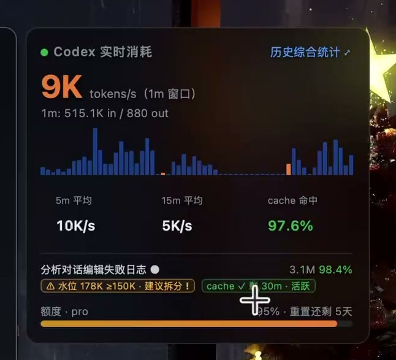
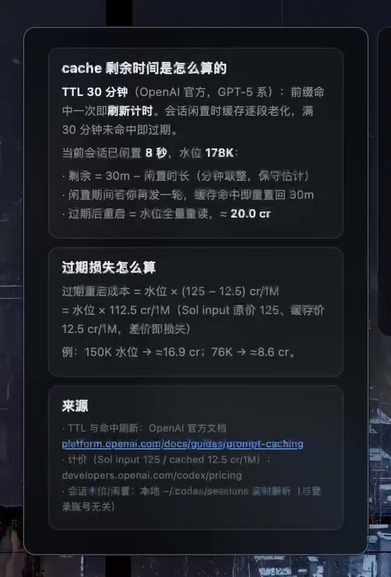
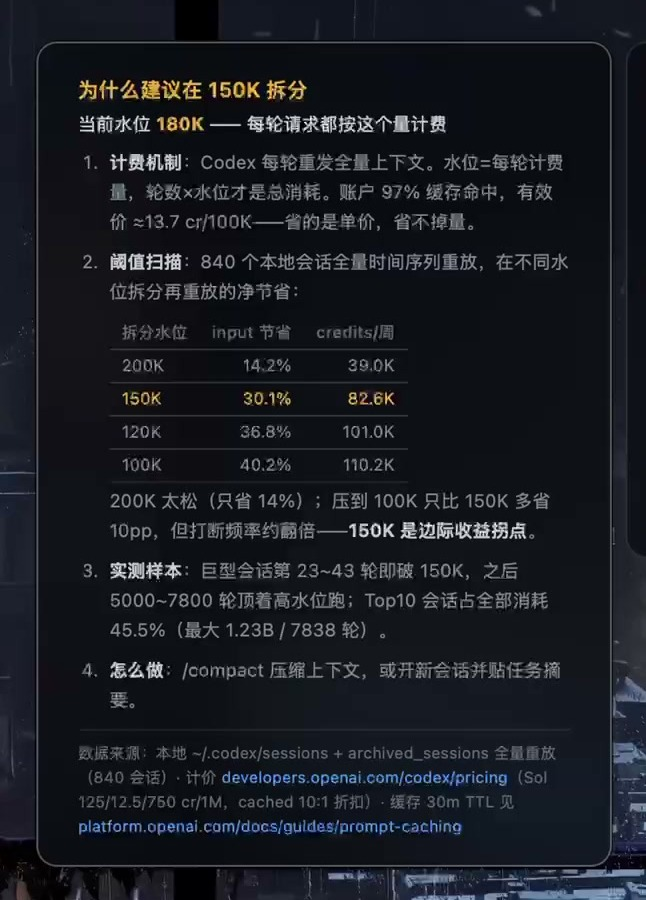
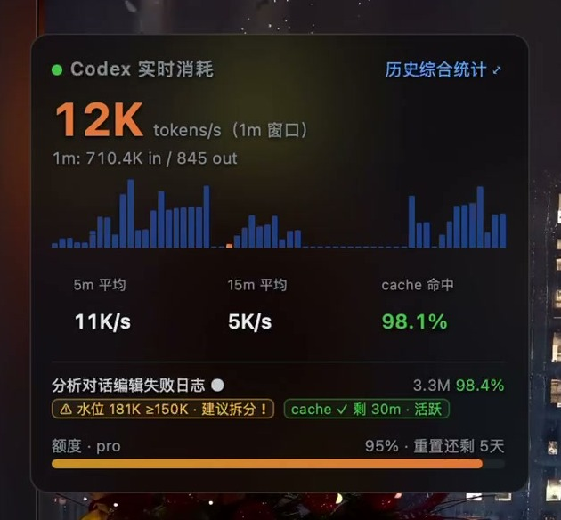
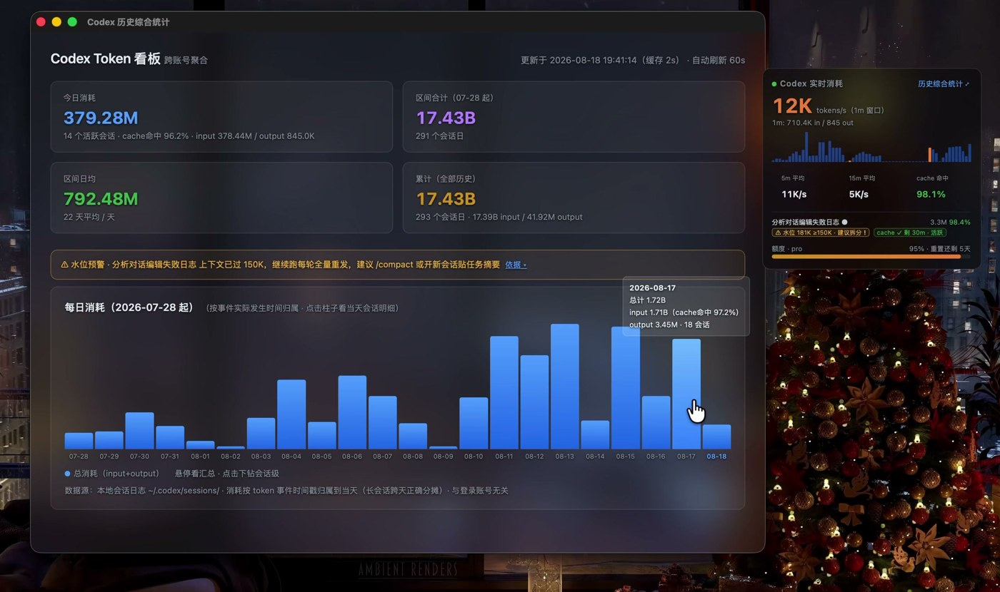

# codexgauge 📊

English | [中文](README.zh-CN.md)

> Every Codex usage tool shows how much you've burned. This one shows **how fast you're burning, right now** — and when to split before it hurts.


A floating macOS dashboard for [OpenAI Codex](https://developers.openai.com/codex/) usage: **live burn rate, cache TTL countdown, and session-split advice computed from your own session history** — in a frosted-glass panel that stays out of your way.

---

## Why

Quota widgets answer *"how much is left?"*. None of them answer the questions you actually have while a long task is running:

### 🔥 Burn rate, live



- **1m / 5m / 15m rolling windows** of token consumption, refreshed every **5 seconds**
- **30-minute sparkline** at 30s granularity, input vs. cached split
- Active session indicator — see *which* conversation is doing the burning
- Cheap to run: incremental parsing only ever reads the **new bytes** appended to session logs

### ⏳ Is the cache still warm?



Prompt caching gives a 10× discount on cached input, but the prefix **ages out after 30 minutes** of no hits. codexgauge tracks cached tokens separately and computes a **live TTL countdown** for the current session:

> Idle for 20 minutes? The widget tells you the cache has ~10 minutes left — come back before it expires, or accept that the next turn pays full price on the whole context.

### ✂️ Should you split this session?



Not a rule of thumb — a **replay sweep over your own archive**:

- Replays your full local session history as a time series and simulates *"compact at threshold X, then continue"* at multiple watermarks, measuring net savings
- Argues from marginal benefit. On my archive (**840 sessions**):

| Split at | input saved | credits/week |
|---|---|---|
| 200K | 14.2% | 39.0K |
| **150K** | **30.1%** | **82.6K** |
| 120K | 36.8% | 101.0K |
| 100K | 40.2% | 110.2K |

  Pushing from 150K to 100K buys only ~10pp more savings while roughly doubling interruptions — **150K is the knee**. (Your mileage gets recomputed from your own sessions.)
- Backed by the billing math: every turn re-sends the full context, so watermark × turns is what you pay. The top-10 monster sessions in my archive account for **45.5%** of all consumption (largest: 1.23B tokens over 7,838 turns).

---

## The widget



- Borderless `NSPanel` + `WKWebView`, native vibrancy (frosted glass) that self-dims on light wallpapers
- Drag by the top handle; every other pixel clicks through to the page — bar drill-downs and buttons work
- Right-click menu · position memory · visible on all Spaces, including full-screen
- Served from `127.0.0.1:8790` — localhost only, no cloud, no telemetry, no API keys

## How it works

1. **Data source**: `~/.codex/sessions/*.jsonl` (+ archived sessions) — the files Codex CLI already writes. Nothing else is read.
2. **Incremental parsing**: per-file cache of `(mtime, size, inode, offset)`. Only bytes past the last checkpoint are parsed; trailing partial lines are buffered for the next pass. A background thread refreshes every 5s; API requests always hit the hot cache (synchronous recompute only as a fallback if the refresher dies).
3. **Event-time accounting**: every token event is attributed to the day it *happened* — a session spanning midnight no longer dumps its whole cost on the creation date. Multiple rollout files for one session are deduped into a single timeline of deltas.
4. **Replay engine**: the split advisor replays history and simulates compaction at swept thresholds to measure net savings per watermark.

Also includes:



- Full web dashboard (daily bars with drill-down, per-session detail with active hours)
- CLI report: `codex_token_report.py [YYYY-MM|--all]` — monthly or full-history totals
- Terminal aggregate monitor: `codex-token-monitor.sh [watch [seconds]]`

## Install

**Prerequisites**: macOS 13+, Python 3.9+ (stdlib only — no pip installs), Codex CLI session logs on disk.

```bash
git clone https://github.com/yorha59/codexgauge && cd codexgauge

# 1. Dashboard server (Web UI + APIs)
python3 codex_token_server.py          # → http://127.0.0.1:8790

# 2. Floating widget — no Xcode project needed
swiftc -O -framework WebKit -framework Cocoa \
      -o codex_widget codex_widget_app.swift
./codex_widget

# 3. (Optional) run at login — the launchd plists are templates:
#    replace /path/to/codexgauge with your clone dir, then:
sed -i '' 's|/path/to/codexgauge|'"$PWD"'|g' com.codexgauge.*.plist
cp com.codexgauge.token-server.plist ~/Library/LaunchAgents/ \
  && launchctl load ~/Library/LaunchAgents/com.codexgauge.token-server.plist
```

> An `install.sh` that automates all of the above (plus a Homebrew cask) is on the roadmap.

## Comparison

|  | codexgauge | [CodexBar](https://github.com/steipete/CodexBar) | [codeburn](https://github.com/getagentseal/codeburn) |
|---|---|---|---|
| Live burn rate (1m/5m/15m + sparkline) | ✅ | — | — |
| Cache hit rate | ✅ live | — | ✅ monthly |
| Cache TTL countdown | ✅ | — | — |
| Session-split advice | ✅ replay-swept thresholds | — | rule heuristics |
| Form factor | floating panel | menu bar | TUI / web / menubar |
| Scope | Codex | 69 providers | 41 tools |
| Dependencies | Python stdlib | Swift native | Node 22+ |

Positioning: codeburn is the monthly audit report; CodexBar is the quota gauge. **codexgauge is the cockpit** — what's happening in *this* session, *right now*.

## FAQ

**Where does the data come from?** Local Codex session logs only. The server binds to 127.0.0.1 and never makes outbound requests.

**Does it slow Codex down?** No. Session files are append-only; the parser reads just the new bytes since the last pass, off the request path.

**Does it need my OpenAI credentials?** No. No API keys, no OAuth, no cookies.

## License

MIT
